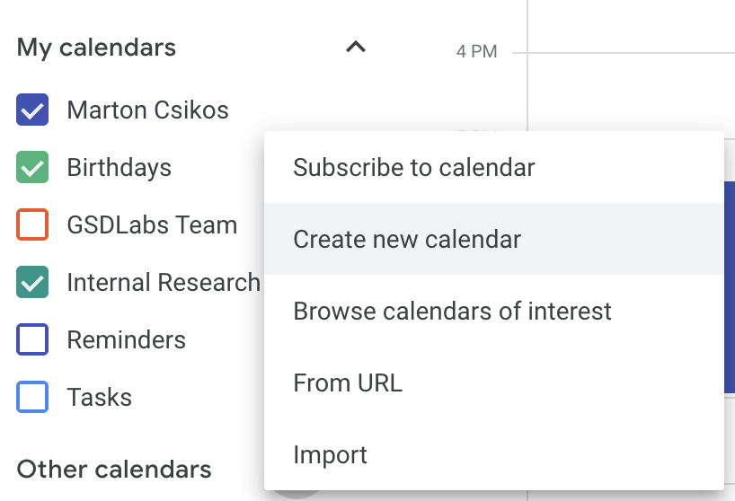
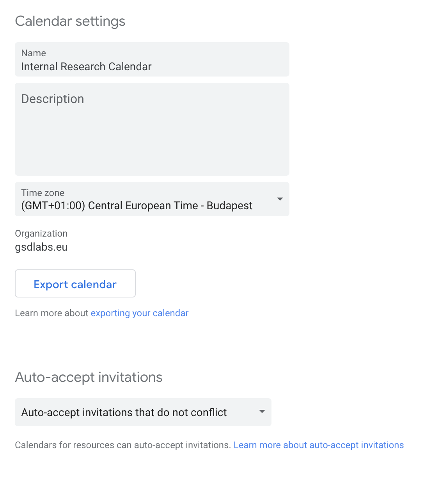
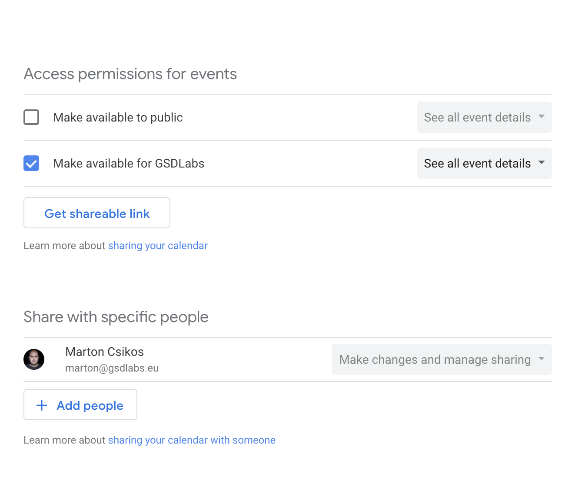
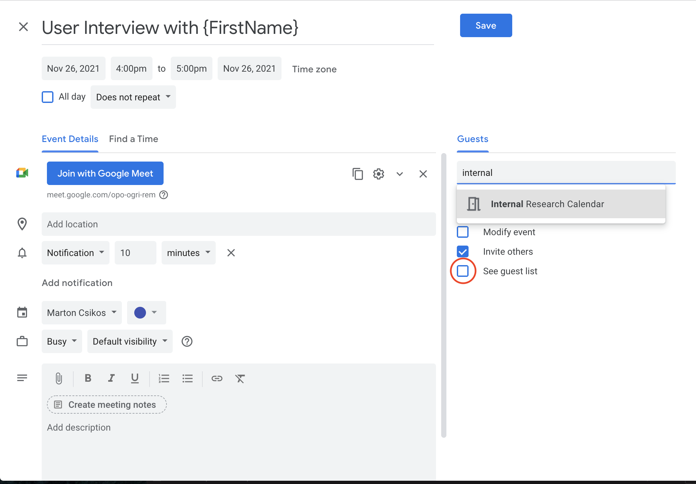
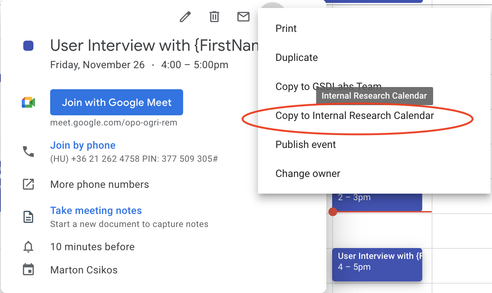

# Setting up a stakeholder calendar

An internal research calendar can be a useful tool to keep participation opportunities on the radar of stakeholders and simplify administration.

## Setting up Google Calendar

**Step1:** Create a new shared calendar in Google Calendar by clicking the plus sign next to `Other Calendars`.

{: style="width:50%"}

> If this option is not available to you, ask your IT admin to create a new calendar and give you permissions to 'Make changes and manage sharing'.

**Step 2:** Give your calendar a name and description and set the `Auto-accept invitations` setting to `Auto-accept invitations that do not conflict`. This will simplify adding events to the calendar.

{: style="width:50%"}

**Step 3:** Set sharing settings for the calendar.

Select `Make available for {Your organization}` under `Access permissions for events` and select `See all event details`. Alternatively, if you want to share the calendar outside of your organization, you can select `Make available to public`, however in this case the calendar will be discoverable and accessible by anyone, which might not be something you want.

Add any other researchers from your team under `Share with specific people` to give them access to `Manage changes and manage sharing`.

{: style="width:50%"}

**Step 4:** Share the calendar.
Click the `Get shareable link` button under `Access permissions for events`. The link will add the calendar for any stakeholder that clicks it. Share it in slack, email, and any other communication channel you have. This is a good opportunity to promote your research and get people interested in participating.

## Using Google Calendar

### Approach 1: Using the same event

To make a research session available in your internal research calendar, invite it to the event, as you would any regular participant.
Make sure you untick `See guest list` under `Guest permissions` so the participant's email address does not show up in the research calendar.

{: style="width:50%"}

The advantage of this approach is that if a participant cancels or reschedules, it will automatically be reflected in your research calendar. The drawback is that there is no way to change the event details in the research calendar, which is not ideal if you want to include internal information or links in the meeting description.

### Approach 2: Copying the event

You can also copy the event to your internal research calendar. This allows you to change the details, but if any changes are made to the original event, you will have to update the event in the research calendar manually.

{: style="width:50%"}

## Adding stakeholders to events

The internal research calendar is a good way to keep stakeholders informed about research opportunities, but inviting stakeholders to sessions is still somewhat of a manual process.

We recommend that you post regular updates in slack if new research opportunities come in.

1. Step 1: Make a post in a relevant slack channel, asking stakeholders to indicate which timeslot they are interested in in a thread.
2. Step 2: Invite interested stakeholders to the appropriate event as you would to a normal calendar event.

The advantage of this process is that you can keep control over who is invited to which session and make sure that sessions don't get overcrowded.
