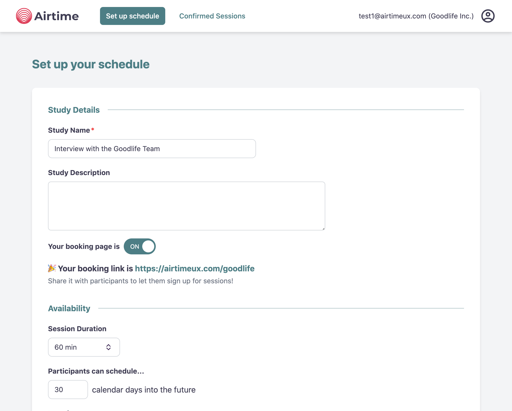

# Using an appointment scheduling tool

To make the scheduling of user sessions easy, we recommend using an online appointment scheduling service.
These tools can save you a lot of time by providing end users with a simple calendar interface where they can sign up to a timeslot when you're available. They can also automatically handle if a participant needs to reschedule or cancel, saving you a lot of email ping-pong.

The beta version of [Airtime](https://www.airtimeux.com/){target=_blank; rel="noreferrer noopener"} comes with built-in appointment scheduling features designed specifically for user researchers that want to implement continuous research. We recommend you give it a shot!

There are a number of alternative scheduling tools with different features and pricing schemes available:

 - [Calendly](https://calendly.com/){target=_blank; rel="noreferrer noopener"} is the most popular tool currently. The free version is enough for executing a single research project, but for long-term use a paid version is necessary.
 - [Cal.com](https://cal.com/){target=_blank; rel="noreferrer noopener"} is an open-source solution that you can run in a self-hosted configuration.
 - [CalendarHero](https://calendarhero.com/){target=_blank; rel="noreferrer noopener"}
 - [Doodle](https://doodle.com/){target=_blank; rel="noreferrer noopener"}
 - [Simplybook.me](https://simplybook.me/en/){target=_blank; rel="noreferrer noopener"}

## Joining the Airtime Beta Program
 
Airtime is a research platform that the authors of this playbook have created with the goal of building the best tool for teams who want to implement a continuous research practice.
We are currently in closed beta and looking for early adopters to test Airtime and give us feedback on the roadmap.

{target=_blank; rel="noreferrer noopener"}

[Join the Beta Program](https://airtimeux.com/airtime_beta?utm_souce=playbook-announcement){target=_blank; .md-button .md-button--primary }

## Alternative: Setting up Calendly

To understand the basics of Calendly, follow the below tutorial:

{target=_blank; rel="noreferrer noopener"}

> **TIP**: The free version of Calendly allows a single event type, which should be sufficient for executing your first research project.

### Using Invitee Questions to segment participants

Calendly has a useful feature that lets you collect information from participants when they sign up for a session. This is a good opportunity to gather some demographic and segmentation data that are relevant for your research project.

{target=_blank; rel="noreferrer noopener"}
