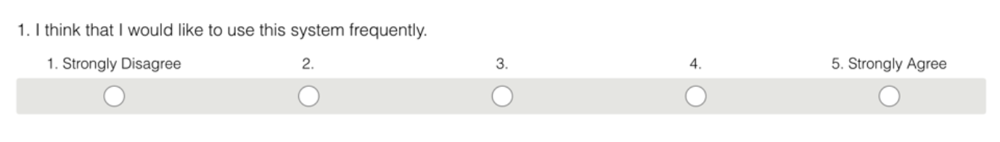

# Impact Survey

An Impact Survey has two goals:

- Measure the customer-centricity of an organization periodically and track improvement.
- Be a leading indicator of key business metrics

Impact Surveys are sent out periodically to teams and include questions in areas that are expected to be impacted by participating in research. They are a self-evaluation tool and the primary audience is the team itself. Instead of a static collection of survey responses, it's important to discuss the results with the team and collaboratively discover ways to improve.

Impact Surveys are not a replacement for other design metrics, but a useful human-centric addition. It is still a good idea to track qualitative design metrics, such as CSAT, and include targets for them in your development projects.

## Question types

Questions in an Impact survey should be a composition of rating scales and free-text answers. Rating scales allow you to quantify answers and track changes over time, while free-text answers let you discover root causes and come up with actions. [Likert scales](https://en.wikipedia.org/wiki/Likert_scale){target=_blank} combined with free-text fields asking to elaborate on the rating are a good start. Similar questions are used in many standard UX surveys, such as SUS (System Usability Scale). 

## Coming up with questions

Questions in an Impact Survey should measure areas that you expect to be positively impacted by customer exposure. You can use the below formula to define them.

**Impact**: Start with defining an impact customer exposure will have on the team.  
**Benefit**: Define why that impact matters.  
**Business Metric**: Remember that impact survey questions are leading indicators that are meant to forecast future improvements in other business metrics. This is where you define that metric. You can't and don't have to model the exact mathematical relationship, just thinking it through helps with formulating better questions  
**Survey Statement**: This is your final statement that you will include in the survey that the team has to agree/disagree with.  

## Example questions

**Impact**: Customer exposure will increase the team's empathy with users.  
**Benefit**: The team will build products and features that customers will be happy with.  
**Business metric**: CSAT / NPS.  
**Survey statement**: I have a thorough understanding of user needs.  

**Impact**: Customer exposure will increase the team's motivation.  
**Benefit**: The team will find their work more meaningful and feel happier in their jobs.  
**Business metric**: Employee retention.  
**Survey statement**: I feel motivated by engaging with users.  

> Motivation is an often-overlooked benefit of customer exposure. Seeing the products and features they have worked on in action and helping other people is one of the best ways to make people feel their work is meaningful.

## Template

You can copy our Google Forms [Impact Survey Template](https://docs.google.com/forms/d/e/1FAIpQLScuCrSh3AvxXexmTR_y2ixINZ7jUTWdEVxrDleXY3jUUT986Q/viewform?usp=sf_link){target=_blank} and start building your own.

The built-in "Responses" feature of Google Forms provides a perfectly good overview of responses for most cases.
For more detailed analysis, such as observing trends over time, you can link the Form to a Google Sheet or export the responses in CSV and conduct your analysis in a Pivot Table in a spreadsheet tool.

