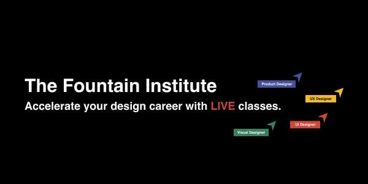

# Templates

This is a collection of all the templates referrenced in this guide:

- **[Miro Continuous Research Planning Template](https://miro.com/app/board/uXjVOcvVHRM=/?moveToWidget=3458764514680355484&cot=14){target=_blank}**
- **[Miro Collaborative Note Taking and Debriefing Template](https://miro.com/app/board/uXjVOcvVHRM=/?moveToWidget=3458764514681714737&cot=14){target=_blank}**
- **[Google Forms Impact Survey Template](https://docs.google.com/forms/d/e/1FAIpQLScuCrSh3AvxXexmTR_y2ixINZ7jUTWdEVxrDleXY3jUUT986Q/viewform?usp=sf_link){target=_blank}**
- **[Airtable Measure Time Spent with Users Template](https://airtable.com/invite/l?inviteId=invXWyYXZiLPPu1Ri&inviteToken=86c0d2bb504835fc89ee0011af2f9ef42898680cee7d820e8d549148fe7b2835&utm_source=email){target=_blank}**

Want to learn more about setting up a continuous research pipeline and access many more similar templates? Check out the live courses offered by our friends at [**The Fountain Institue**](https://www.thefountaininstitute.com/){target=_blank}!

[{: style="width:75%"}](https://www.thefountaininstitute.com/){target=_blank}
