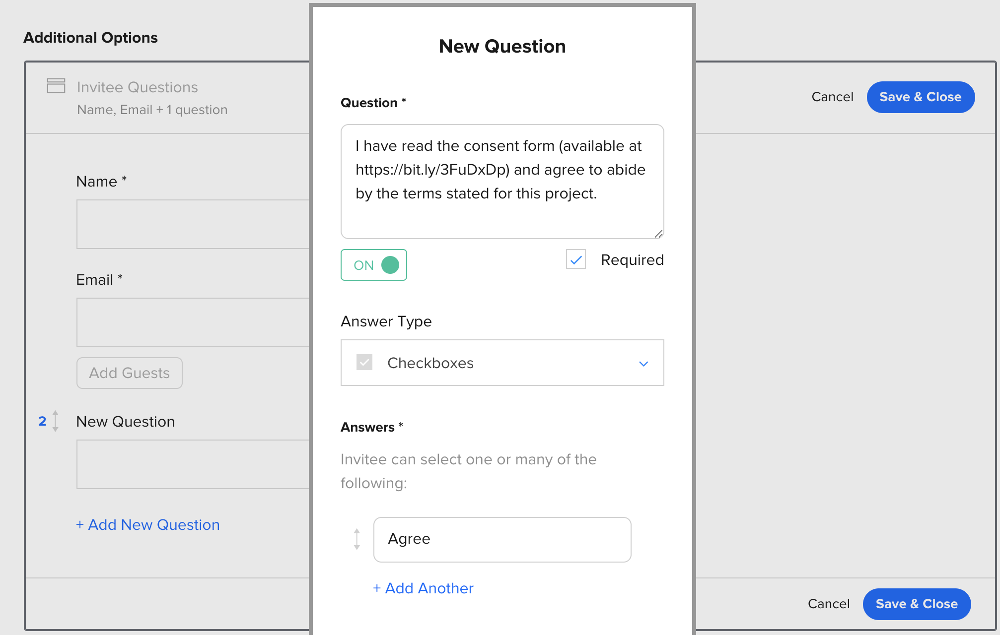

# Getting consent

To comply with GDPR requirements you need to make sure that every participant has given consent before participating in research.

> **TIP**: If you don't yet have a document for this purpose, you can start with the awesome [Consent Form Builder](https://consentform.herokuapp.com/){target=_blank} created by the [ResearchOps Community](https://researchops.community){target=_blank}

## Using an Invitee Question in Calendly

This is a barebones and straightforward approach consisting of only free steps:

1. **Upload your consent form to a publicly accessible link.** A public PDF in google drive will do.
2. **Create a shortened link to the form.** This improves readability and gets around the character limit for Calendly questions. You can use a link shortener service like [bit.ly](https://www.bitly.com).
3. **Set up a custom question in calendly using the link to your form.** Make sure the question is required.

## Using a research governance platform

If you need more sophisticated research governance features [Consentkit](https://consentkit.com/){target=_blank} is a good alternative. Watch this tutorial to get started:

{target=_blank}

In this setup, you have to manually send out the consent form from Consentkit to every participant that signs up for a session. It's a bit of work to keep everything in sync.
